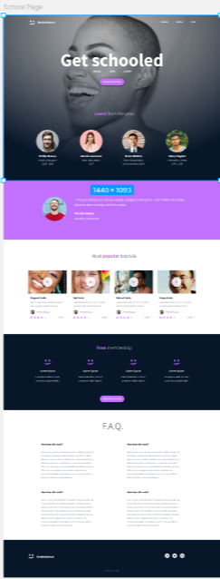

# HTML, advanced

This project consists of building a web page only semantic HTML, based on a figma design.
The goal is to understand how to properly structure a webpage without using any CSS or styling.

By completing this project, we learn how to organize content using semantic tags such as header, main, section and footer.
This is an important step before moving on to styling and responsive design.

## Preview

  

## Author
Malik Bouanani